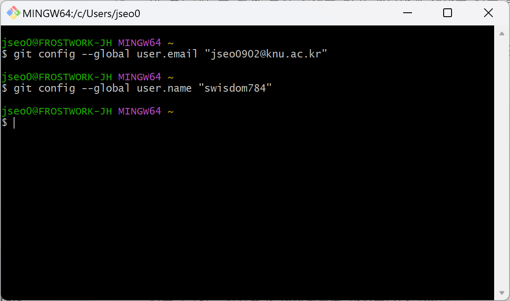
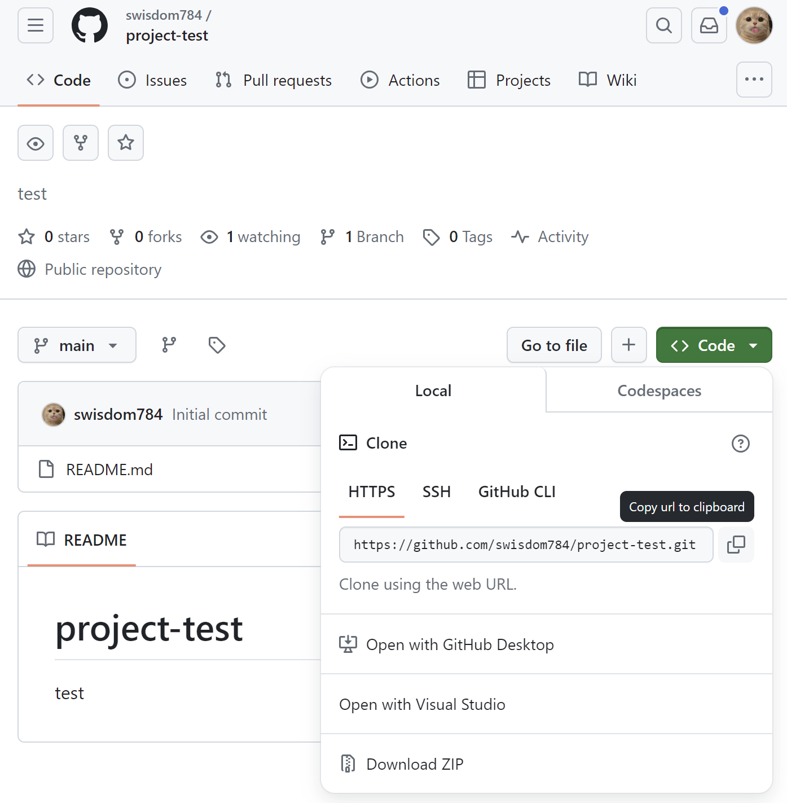
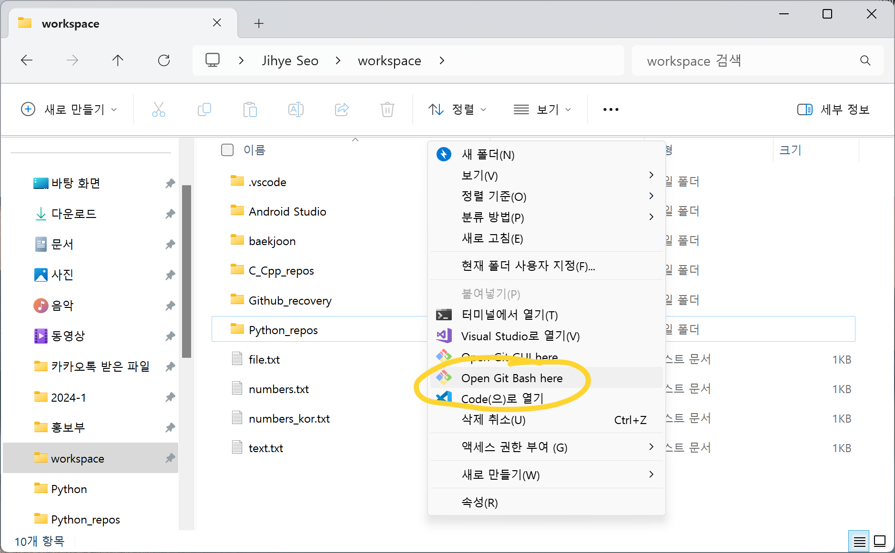
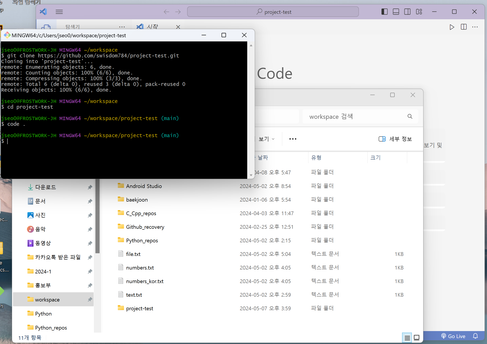
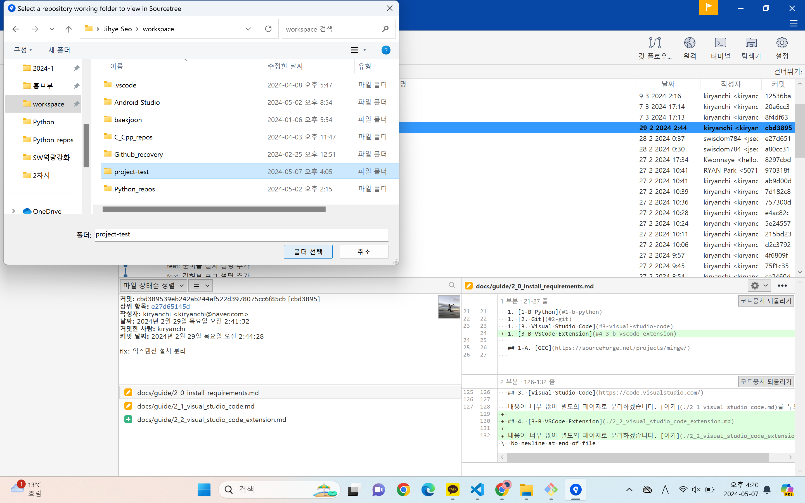
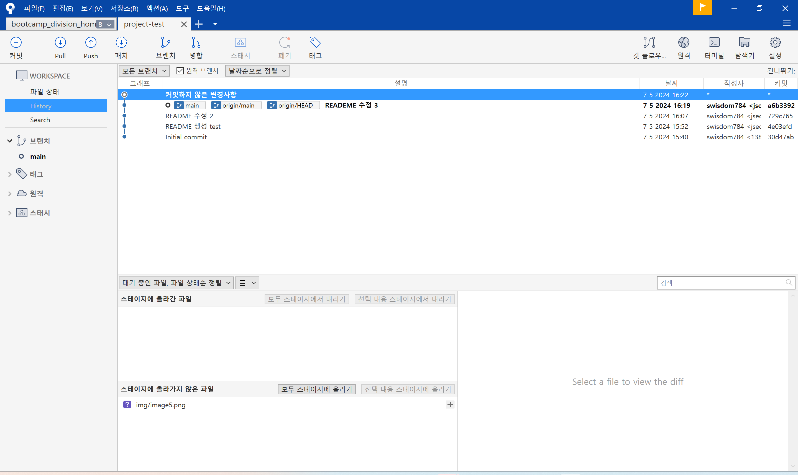
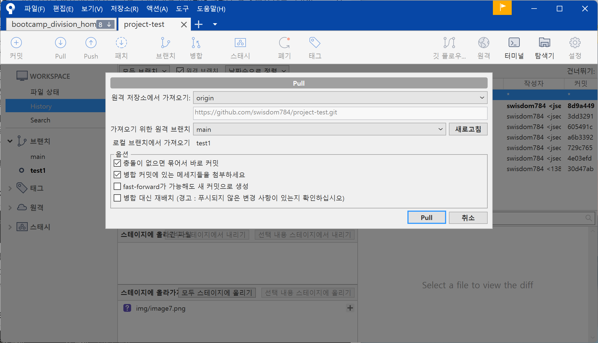
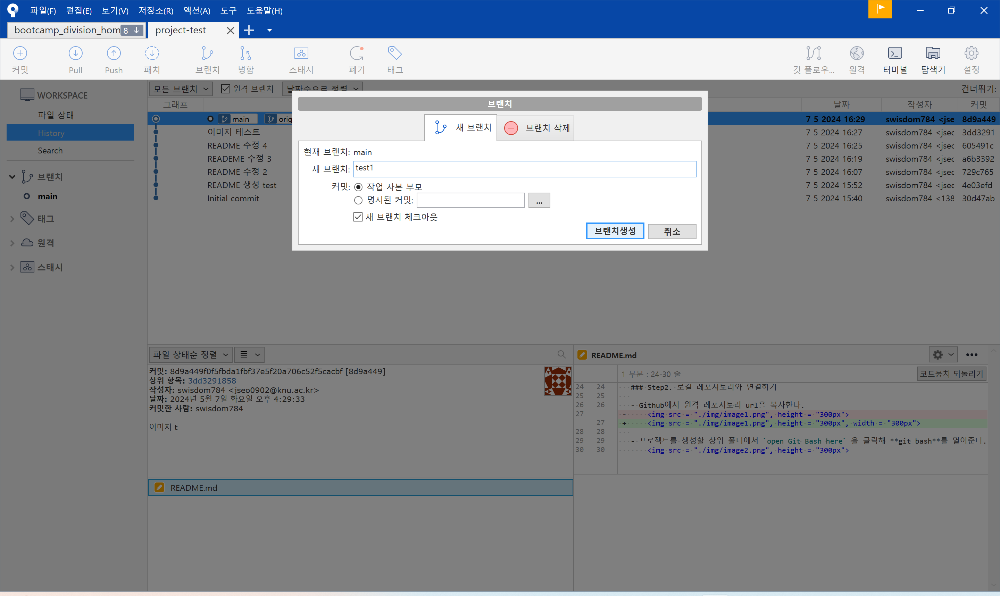
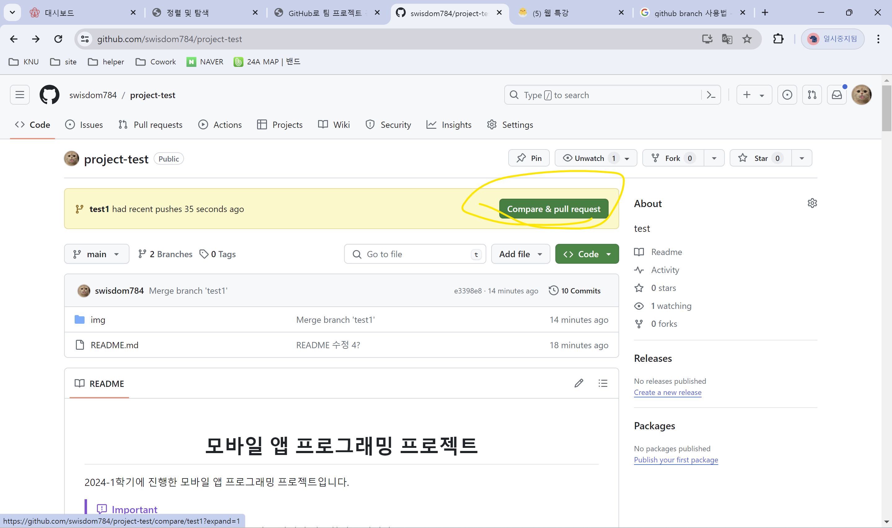
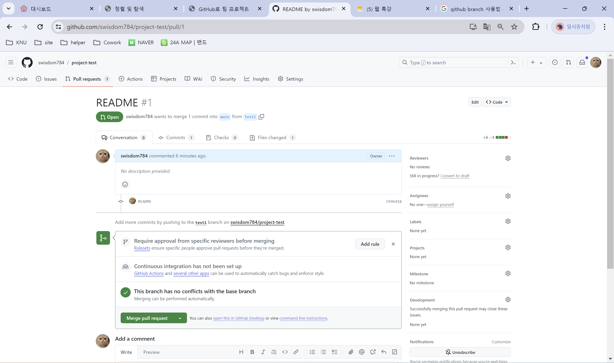

# Cowork Guide

> [!IMPORTANT]
>
> 하단의 내용을 반드시 꼼꼼하게 읽어보고 작업하시기 바랍니다.

## 🚨 깃허브 협업 시작하기

### Step0. Git에 내 정보 넣기
- `Git` 설치하고, `Git bash`를 연다
- Git에게 나의 이메일 주소와 유저명을 알려주자
- 아래의 명령어대로 Github를 가입할 때 입력한 이메일 주소와 유저명을 입력해준다.

### Step1. 팀 레포지토리에 팀원 초대하기

- 프로젝트 관리자가 프로젝트를 생성한다.
    - Settings -> Collaborators -> Add collaborator

- 메일로 `Collaborator` 초대를 받은 뒤 `Accept invitation`을 눌러 수락한다.

- 관리자가 레포지토리 상단에서 `pin`을 클릭하면 즐겨찾기에 추가되고, 팀원들의 프로필 메인에서도 볼 수 있다.

### Step2. 로컬 레포지토리와 연결하기

- Github에서 원격 레포지토리 url을 복사한다.

    

- 프로젝트를 생성할 상위 폴더에서 `open Git Bash here` 을 클릭해 **git bash**를 열어준다. 

    

- git bash에서 repository를 `clone`한다.

    

- clone한 repository를 **Visual Studio Code**로 열어준다.

    

### Step3. Sourcetree와 연결하기
- `Sourcetree`를 실행한다.

    - 파일 -> 열기 -> 폴더선택

        
        

- 쉽게 프로젝트와 브랜치를 관리할 수 있게 된다.

## ✨ Github 협업 가이드

- 로컬 저장소에서 작업을 한 후에는 원격저장소로 업로드 해 결과물을 합쳐야 한다.

- **`main`** 은 완성물만 있어야 하기 때문에 작업물을 올리고 문제가 없는지 확인한 후 `main` 브랜치로 합쳐야 한다.

- 따라서 자신의 작업물을 만든 후에는 **새로운 브랜치**를 파고 거기에 `push` 한다.

- 이후 팀원들이 새로운 브랜치에 `push`된 내용을 확인하고, 문제가 없다는 것이 확인되면 `main` 브랜치로 **`merge`** 요청을 하면 된다. 이를 관리자가 승인하면 `main` 브랜치로 합쳐진다.

### Branch를 생성하고, 내 작업물 만들기

- Sourcetree를 켠다.
- 작업을 진행하기 전, `Pull`을 먼저 해준다.

    - `Pull` -> `main` pull 해주기

        

- Sourcetree -> 브랜치 -> 브랜치 생성

    - 브랜치의 이름은 **작업자 이름**으로 한다.

    

- 해당 브랜치에서 작업한다.

    - **반드시!!** 해당 브랜치로 이동되어있는지 확인한다.

    - VSC 화면 왼쪽 하단을 보면 알 수 있다.

- 해당 브랜치에서 작업한 내용을 add, commit, push한다.

    - commit할 때에는 어떤 작업을 수행했는지 반드시 메세지를 작성한다.

### 팀원들의 확인 후 합치기

- 이후 Github에서 팀원들이 내용을 확인하고, 댓글도 달고 문제되는 점이 없는지 확인한다.

- 댓글들을 확인 후 자신의 작업물을 compare & pull request 해준다.

    - 반드시 **`base: main <- compare: 브랜치명`** 으로 되어있는 지 확인하고, `create pull request`를 해준다.

        

- 관리자가 확인 후 `merge`를 최종 수락하면 합치는 것이 완료된다.

    